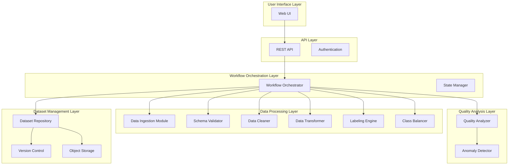

# Design Document: AutoDataset Platform

## Overview

The AutoDataset platform is a self-hosted automated dataset engineering system that transforms raw data from various sources into machine-learning-ready datasets. The architecture follows a modular, pipeline-based design with six primary layers: User Interface, API, Workflow Orchestration, Data Processing, Quality Analysis, and Dataset Management.

The system treats datasets as buildable artifacts with full versioning, reproducibility, and quality guarantees. Users define specifications through a web UI or REST API, triggering an orchestrated pipeline that ingests, validates, cleans, transforms, labels, balances, and validates data before generating structured output artifacts.

### Key Design Principles

1. **Modularity**: Each processing stage is an independent, composable module
2. **Reproducibility**: All operations are deterministic and fully logged
3. **Scalability**: Horizontal scaling of processing components
4. **Fault Tolerance**: Graceful error handling with pipeline resumption
5. **Quality-First**: Continuous validation with configurable quality gates

## Architecture

The platform consists of six architectural layers:



### Layer Responsibilities

**User Interface Layer**: Provides web-based forms for specification definition, pipeline monitoring dashboards, dataset browsing, and artifact download.

**API Layer**: Exposes RESTful endpoints for programmatic access, handles authentication/authorization, validates requests, and returns structured responses.

**Workflow Orchestration Layer**: Manages pipeline execution, enforces stage dependencies, tracks execution state, handles failures, and provides resumption capabilities.

**Data Processing Layer**: Executes data transformation stages including ingestion, validation, cleaning, transformation, labeling, and balancing.

**Quality Analysis Layer**: Evaluates dataset quality, computes metrics, detects anomalies, and enforces quality thresholds.

**Dataset Management Layer**: Stores versioned datasets, maintains metadata and lineage, provides query capabilities, and manages artifact generation.

## Components and Interfaces

### Dataset Specification

The specification is the input contract defining what dataset to build:

```python
class DatasetSpecification:
    spec_id: str
    domain: str  # e.g., "healthcare", "finance", "e-commerce"
    task_type: TaskType  # CLASSIFICATION, REGRESSION, CLUSTERING, TIME_SERIES
    target_variable: str
    dataset_size: int
    class_balance_constraints: Optional[Dict[str, float]]
    quality_thresholds: QualityThresholds
    data_sources: List[DataSource]
    feature_config: FeatureConfig
    created_at: datetime
    created_by: str

class TaskType(Enum):
    CLASSIFICATION = "classification"
    REGRESSION = "regression"
    CLUSTERING = "clustering"
    TIME_SERIES = "time_series"

class QualityThresholds:
    min_completeness: float  # 0.0 to 1.0
    min_consistency: float
    min_accuracy: float
    max_anomaly_rate: float

class DataSource:
    source_id: str
    source_type: SourceType  # WEB, API, PUBLIC_DATASET
    location: str  # URL, API endpoint, or dataset identifier
    auth_config: Optional[AuthConfig]
    format: DataFormat  # CSV, JSON, XML, PARQUET
```

### Data Ingestion Module

Fetches data from configured sources with error handling and rate limiting:

```python
class DataIngestionModule:
    def ingest(self, sources: List[DataSource]) -> IngestionResult:
        """
        Ingest data from multiple sources.
        Returns raw data and ingestion metadata.
        """
        pass
    
    def fetch_from_web(self, source: DataSource) -> RawData:
        """Fetch data from web URLs with retry logic."""
        pass
    
    def fetch_from_api(self, source: DataSource) -> RawData:
        """Fetch data from APIs with auth, pagination, and rate limiting."""
        pass
    
    def fetch_from_public_dataset(self, source: DataSource) -> RawData:
        """Fetch data from public dataset repositories."""
        pass

class IngestionResult:
    raw_data: List[RawData]
    successful_sources: List[str]
    failed_sources: List[SourceError]
    ingestion_metadata: IngestionMetadata
```

### Schema Validator

Validates data structure and enforces schema constraints:

```python
class SchemaValidator:
    def validate(self, data: RawData, expected_schema: Optional[Schema]) -> ValidationResult:
        """
        Validate data against schema.
        If no schema provided, infer schema from data.
        """
        pass
    
    def infer_schema(self, data: RawData) -> Schema:
        """Infer schema from data structure."""
        pass
    
    def check_compatibility(self, schemas: List[Schema]) -> CompatibilityResult:
        """Check if multiple schemas are compatible for merging."""
        pass

class Schema:
    fields: List[FieldDefinition]
    constraints: List[Constraint]

class FieldDefinition:
    name: str
    data_type: DataType
    nullable: bool
    constraints: List[FieldConstraint]

class ValidationResult:
    is_valid: bool
    violations: List[SchemaViolation]
    inferred_schema: Optional[Schema]
```

### Data Cleaner

Removes inconsistencies, handles missing values, and normalizes data:

```python
class DataCleaner:
    def clean(self, data: RawData, config: CleaningConfig) -> CleaningResult:
        """
        Clean data according to configuration.
        Returns cleaned data and cleaning report.
        """
        pass
    
    def remove_duplicates(self, data: RawData) -> RawData:
        """Remove duplicate records."""
        pass
    
    def handle_missing_values(self, data: RawData, strategy: MissingValueStrategy) -> RawData:
        """Handle missing values using specified strategy."""
        pass
    
    def normalize_features(self, data: RawData, config: NormalizationConfig) -> RawData:
        """Normalize numerical features."""
        pass
    
    def handle_outliers(self, data: RawData, config: OutlierConfig) -> RawData:
        """Detect and handle outliers."""
        pass

class CleaningConfig:
    remove_duplicates: bool
    missing_value_strategy: MissingValueStrategy
    normalization_config: NormalizationConfig
    outlier_config: OutlierConfig

class CleaningResult:
    cleaned_data: RawData
    cleaning_report: CleaningReport
```

### Data Transformer

Performs feature engineering and data transformations:

```python
class DataTransformer:
    def transform(self, data: RawData, config: TransformationConfig) -> TransformationResult:
        """
        Apply transformations to data.
        Returns transformed data and transformation log.
        """
        pass
    
    def encode_categorical(self, data: RawData, method: EncodingMethod) -> RawData:
        """Encode categorical variables."""
        pass
    
    def generate_derived_features(self, data: RawData, rules: List[FeatureRule]) -> RawData:
        """Generate derived features based on rules."""
        pass
    
    def apply_custom_transformation(self, data: RawData, func: TransformFunction) -> RawData:
        """Apply user-defined transformation function."""
        pass

class TransformationConfig:
    encoding_method: EncodingMethod
    feature_rules: List[FeatureRule]
    custom_transformations: List[TransformFunction]
    scaling_config: ScalingConfig

class TransformationResult:
    transformed_data: RawData
    transformation_log: TransformationLog
    feature_metadata: FeatureMetadata
```

### Labeling Engine

Applies rule-based or assisted labeling:

```python
class LabelingEngine:
    def label(self, data: RawData, config: LabelingConfig) -> LabelingResult:
        """
        Apply labeling to data.
        Returns labeled data and labeling report.
        """
        pass
    
    def apply_rules(self, data: RawData, rules: List[LabelingRule]) -> RawData:
        """Apply rule-based labeling."""
        pass
    
    def validate_labels(self, data: RawData, target_spec: str) -> ValidationResult:
        """Validate that labels match target variable specification."""
        pass

class LabelingConfig:
    labeling_rules: List[LabelingRule]
    target_variable: str
    confidence_threshold: float

class LabelingResult:
    labeled_data: RawData
    labeling_report: LabelingReport
    confidence_scores: Optional[List[float]]
```

### Class Balancer

Adjusts class distributions according to constraints:

```python
class ClassBalancer:
    def balance(self, data: RawData, constraints: Dict[str, float], target_size: int) -> BalancingResult:
        """
        Balance class distribution.
        Returns balanced data and balancing report.
        """
        pass
    
    def oversample(self, data: RawData, target_counts: Dict[str, int]) -> RawData:
        """Oversample minority classes."""
        pass
    
    def undersample(self, data: RawData, target_counts: Dict[str, int]) -> RawData:
        """Undersample majority classes."""
        pass
    
    def generate_synthetic(self, data: RawData, target_counts: Dict[str, int], method: str) -> RawData:
        """Generate synthetic samples using SMOTE or similar."""
        pass

class BalancingResult:
    balanced_data: RawData
    final_distribution: Dict[str, int]
    balancing_report: BalancingReport
```

### Quality Analyzer

Evaluates dataset quality and detects anomalies:

```python
class QualityAnalyzer:
    def analyze(self, data: RawData, thresholds: QualityThresholds) -> QualityResult:
        """
        Analyze dataset quality.
        Returns quality metrics and pass/fail status.
        """
        pass
    
    def compute_completeness(self, data: RawData) -> float:
        """Compute completeness metric (ratio of non-null values)."""
        pass
    
    def compute_consistency(self, data: RawData) -> float:
        """Compute consistency metric (adherence to constraints)."""
        pass
    
    def compute_accuracy(self, data: RawData) -> float:
        """Compute accuracy metric (correctness of values)."""
        pass

class AnomalyDetector:
    def detect(self, data: RawData) -> AnomalyResult:
        """
        Detect anomalies in data.
        Returns anomalies with severity levels.
        """
        pass

class QualityResult:
    metrics: QualityMetrics
    passes_thresholds: bool
    quality_report: QualityReport
    anomalies: AnomalyResult
```

### Workflow Orchestrator

Coordinates pipeline execution:

```python
class WorkflowOrchestrator:
    def execute_pipeline(self, spec: DatasetSpecification) -> PipelineResult:
        """
        Execute complete dataset generation pipeline.
        Returns pipeline result with status and artifacts.
        """
        pass
    
    def execute_stage(self, stage: PipelineStage, input_data: Any) -> StageResult:
        """Execute a single pipeline stage."""
        pass
    
    def resume_pipeline(self, pipeline_id: str, from_stage: str) -> PipelineResult:
        """Resume failed pipeline from specified stage."""
        pass
    
    def get_pipeline_status(self, pipeline_id: str) -> PipelineStatus:
        """Get current status of pipeline execution."""
        pass

class PipelineStage(Enum):
    INGESTION = "ingestion"
    SCHEMA_VALIDATION = "schema_validation"
    CLEANING = "cleaning"
    TRANSFORMATION = "transformation"
    LABELING = "labeling"
    BALANCING = "balancing"
    QUALITY_ANALYSIS = "quality_analysis"
    ARTIFACT_GENERATION = "artifact_generation"

class PipelineResult:
    pipeline_id: str
    status: PipelineStatus
    dataset_version: Optional[DatasetVersion]
    artifacts: Optional[OutputArtifacts]
    error: Optional[PipelineError]
```

### Dataset Repository

Manages versioned datasets and metadata:

```python
class DatasetRepository:
    def create_version(self, data: RawData, spec: DatasetSpecification, metadata: DatasetMetadata) -> DatasetVersion:
        """
        Create immutable dataset version.
        Returns version identifier and storage location.
        """
        pass
    
    def get_version(self, version_id: str) -> DatasetVersion:
        """Retrieve specific dataset version."""
        pass
    
    def query_datasets(self, filters: QueryFilters) -> List[DatasetVersion]:
        """Query datasets by version, specification, or date."""
        pass
    
    def generate_artifacts(self, version: DatasetVersion, formats: List[str]) -> OutputArtifacts:
        """Generate output artifacts in specified formats."""
        pass

class DatasetVersion:
    version_id: str
    spec_id: str
    data_location: str
    metadata: DatasetMetadata
    lineage: DatasetLineage
    created_at: datetime

class OutputArtifacts:
    dataset_files: Dict[str, str]  # format -> file path
    metadata_file: str
    schema_file: str
    quality_report_file: str
    archive_path: Optional[str]
```

### REST API

Exposes programmatic interface:

```python
class DatasetAPI:
    # Specification endpoints
    POST /api/v1/specifications
    GET /api/v1/specifications/{spec_id}
    PUT /api/v1/specifications/{spec_id}
    DELETE /api/v1/specifications/{spec_id}
    
    # Pipeline endpoints
    POST /api/v1/pipelines/execute
    GET /api/v1/pipelines/{pipeline_id}/status
    POST /api/v1/pipelines/{pipeline_id}/resume
    
    # Dataset endpoints
    GET /api/v1/datasets
    GET /api/v1/datasets/{version_id}
    GET /api/v1/datasets/{version_id}/artifacts
    GET /api/v1/datasets/{version_id}/download
    
    # Health and monitoring
    GET /api/v1/health
    GET /api/v1/metrics
```

## Data Models

### Core Data Structures

```python
class RawData:
    """
    Internal representation of data at any pipeline stage.
    Supports multiple formats and maintains metadata.
    """
    records: List[Dict[str, Any]]
    schema: Schema
    metadata: DataMetadata
    format: DataFormat

class DataMetadata:
    record_count: int
    column_count: int
    size_bytes: int
    source_references: List[str]
    processing_history: List[ProcessingStep]

class ProcessingStep:
    stage: str
    timestamp: datetime
    parameters: Dict[str, Any]
    metrics: Dict[str, Any]

class DatasetMetadata:
    """
    Complete metadata for a versioned dataset.
    """
    version_id: str
    spec: DatasetSpecification
    statistics: DatasetStatistics
    quality_metrics: QualityMetrics
    lineage: DatasetLineage
    processing_time: float
    artifact_locations: Dict[str, str]

class DatasetStatistics:
    record_count: int
    feature_count: int
    class_distribution: Optional[Dict[str, int]]
    feature_statistics: Dict[str, FeatureStats]
    missing_value_counts: Dict[str, int]

class DatasetLineage:
    source_data_references: List[str]
    pipeline_stages: List[ProcessingStep]
    transformation_log: List[str]
    reproducibility_hash: str
```

## Correctness Properties

*A property is a characteristic or behavior that should hold true across all valid executions of a system—essentially, a formal statement about what the system should do. Properties serve as the bridge between human-readable specifications and machine-verifiable correctness guarantees.*


### Property 1: Specification Validation Completeness
*For any* dataset specification, when validation is performed, all required fields (domain, task_type, target_variable, dataset_size, quality_thresholds, data_sources) must be checked, and any missing or invalid fields must result in descriptive error messages that identify the specific field names.

**Validates: Requirements 1.2, 1.3**

### Property 2: Class Balance Constraint Validation
*For any* class balance constraints specified by a user, the sum of all class proportions must equal 1.0 (within floating-point tolerance), and the validation must reject constraints that violate this property.

**Validates: Requirements 1.5**

### Property 3: Data Ingestion Resilience
*For any* set of data sources, when ingestion is performed, failures in individual sources must not prevent ingestion from other sources, and all failures must be logged with error details while successful sources are processed.

**Validates: Requirements 2.1, 2.2**

### Property 4: Raw Data Preservation
*For any* data ingestion operation, the raw ingested data must be stored in a location separate from processed data, ensuring reproducibility by maintaining the original source data.

**Validates: Requirements 2.5**

### Property 5: Schema Validation Comprehensiveness
*For any* ingested data and expected schema, validation must detect all missing required fields, incorrect data types, and constraint violations, and generate a detailed report listing each specific violation.

**Validates: Requirements 3.1, 3.2, 3.3**

### Property 6: Schema Inference
*For any* ingested data without an explicit schema, the schema validator must infer a schema that accurately represents the data structure including field names, data types, and nullability.

**Validates: Requirements 3.4**

### Property 7: Multi-Source Schema Compatibility
*For any* set of data sources with different schemas, the schema validator must check compatibility and either merge compatible schemas or report incompatibility with specific conflicting fields.

**Validates: Requirements 3.5**

### Property 8: Duplicate Record Removal
*For any* dataset containing duplicate records, the data cleaner must remove all duplicates such that the resulting dataset contains only unique records.

**Validates: Requirements 4.1**

### Property 9: Missing Value Handling
*For any* dataset with missing values and any configured strategy (removal, imputation, forward-fill), the data cleaner must handle all missing values according to the strategy, resulting in a dataset with no missing values (for removal/imputation/forward-fill strategies).

**Validates: Requirements 4.2**

### Property 10: Numerical Feature Normalization
*For any* dataset with numerical features and any specified normalization range or distribution, the normalized features must fall within the specified range or match the specified distribution parameters.

**Validates: Requirements 4.3**

### Property 11: Outlier Detection and Handling
*For any* dataset and outlier detection configuration, outliers identified by statistical methods or user-defined rules must be detected and handled (removed, capped, or transformed) according to the configuration.

**Validates: Requirements 4.4**

### Property 12: Cleaning Operation Reporting
*For any* data cleaning operation, a cleaning report must be generated that documents all transformations applied, including duplicate removal count, missing value handling strategy, normalization parameters, and outlier handling actions.

**Validates: Requirements 4.5**

### Property 13: Categorical Encoding Consistency
*For any* dataset with categorical variables and any specified task type, the categorical encoding method (one-hot, label encoding, target encoding) must be appropriate for the task type and consistently applied to all categorical features.

**Validates: Requirements 5.3**

### Property 14: Custom Transformation Application
*For any* dataset and any user-defined transformation function, the transformation must be applied to all specified features, and the transformation must be recorded in the transformation log.

**Validates: Requirements 5.4**

### Property 15: Transformation Reproducibility
*For any* data transformation operation, a transformation log must be maintained that records all transformations, their parameters, and their order, enabling exact reproduction of the transformation sequence.

**Validates: Requirements 5.5**

### Property 16: Rule-Based Labeling Application
*For any* dataset and any set of labeling rules, the labeling engine must apply all rules to generate labels, and all generated labels must conform to the target variable specification (type, valid values, constraints).

**Validates: Requirements 6.1, 6.3**

### Property 17: Labeling Confidence Tracking
*For any* labeling operation that produces confidence scores, the confidence scores must be tracked and associated with their corresponding records, and the labeling report must include the percentage of successfully labeled records.

**Validates: Requirements 6.4, 6.5**

### Property 18: Class Distribution Balancing
*For any* dataset with class imbalance and any specified class balance constraints, the class balancer must adjust the class distribution such that the final distribution matches the constraints (within tolerance), and the final dataset size must equal the specified target size.

**Validates: Requirements 7.1, 7.3**

### Property 19: Class Balancing Reporting
*For any* class balancing operation, a balancing report must be generated that includes the original class distribution, the target distribution, the balancing strategy used, and the final achieved distribution.

**Validates: Requirements 7.5**

### Property 20: Quality Metrics Computation
*For any* dataset, the quality analyzer must compute all specified quality metrics (completeness, consistency, accuracy, validity) and generate a quality report that includes metric values, threshold comparisons, and pass/fail status.

**Validates: Requirements 8.1, 8.3**

### Property 21: Quality Threshold Enforcement
*For any* dataset and quality thresholds, when any computed quality metric falls below its specified threshold, the quality analyzer must flag the dataset as failing quality checks and include the failing metrics in the report.

**Validates: Requirements 8.2**

### Property 22: Anomaly Detection and Reporting
*For any* dataset, the anomaly detector must identify outliers and unusual patterns, assign severity levels to detected anomalies, and include all anomalies with their severity levels in the quality report.

**Validates: Requirements 8.4, 8.5**

### Property 23: Dataset Version Immutability
*For any* dataset version created in the repository, the version must be immutable such that subsequent attempts to modify the version data, metadata, or artifacts are rejected.

**Validates: Requirements 9.1**

### Property 24: Version Metadata Completeness
*For any* versioned dataset, the repository must store the complete specification, pipeline configuration, source data references, and lineage information, enabling full traceability and reproducibility.

**Validates: Requirements 9.2, 9.5**

### Property 25: Dataset Query Correctness
*For any* query with filters (version ID, specification parameters, creation date range), the repository must return only datasets that match all specified filters, and must return all datasets that match the filters.

**Validates: Requirements 9.3**

### Property 26: Dataset Reproducibility (Round-Trip)
*For any* dataset specification and source data, generating a dataset, storing its specification and configuration, and then regenerating a dataset from the same specification and sources must produce identical results (same records, same features, same statistics).

**Validates: Requirements 9.4**

### Property 27: Output Artifact Completeness
*For any* generated dataset, the output artifacts must include the dataset in all requested formats, a metadata file with statistics and lineage, a schema definition file, a quality report, and all artifacts must be packaged in a structured directory or archive.

**Validates: Requirements 10.1, 10.2, 10.3, 10.4, 10.5**

### Property 28: Pipeline Stage Execution Order
*For any* dataset specification, the workflow orchestrator must execute pipeline stages in the correct dependency order: ingestion → schema validation → cleaning → transformation → labeling → balancing → quality analysis → artifact generation.

**Validates: Requirements 11.1**

### Property 29: Pipeline Failure Handling
*For any* pipeline execution where a stage fails, the orchestrator must halt execution immediately, not execute subsequent stages, and generate a failure report with diagnostic information including the failed stage, error message, and execution context.

**Validates: Requirements 11.2**

### Property 30: Pipeline Resumption
*For any* failed pipeline, when resumption is requested, the orchestrator must resume execution from the last successful stage, skip already-completed stages, and continue with the remaining stages.

**Validates: Requirements 11.3**

### Property 31: Pipeline Status Tracking
*For any* pipeline execution, the orchestrator must track and update the execution status (queued, running, completed, failed) in real-time, and status queries must return the current accurate status.

**Validates: Requirements 11.4**

### Property 32: Pipeline Stage Timeout Enforcement
*For any* pipeline stage with a configured timeout, if the stage execution exceeds the timeout limit, the orchestrator must terminate the stage and mark the pipeline as failed with a timeout error.

**Validates: Requirements 11.5**

### Property 33: API Specification CRUD Operations
*For any* dataset specification, the API must support creating (POST), retrieving (GET), updating (PUT), and deleting (DELETE) the specification, and each operation must correctly modify or return the specification data.

**Validates: Requirements 12.1**

### Property 34: API Dataset Retrieval
*For any* dataset version stored in the repository, the API must provide endpoints that successfully retrieve the dataset metadata, the dataset data, and all associated artifacts.

**Validates: Requirements 12.3**

### Property 35: API Error Response Correctness
*For any* malformed API request (missing required fields, invalid JSON, incorrect data types), the API must return an appropriate HTTP status code (400, 404, 422) and an error message that describes the specific problem.

**Validates: Requirements 12.4**

### Property 36: API Authentication Enforcement
*For any* API endpoint, requests without valid authentication credentials must be rejected with a 401 Unauthorized status, and requests with valid credentials but insufficient permissions must be rejected with a 403 Forbidden status.

**Validates: Requirements 12.5**

### Property 37: Storage Persistence
*For any* dataset, metadata, or configuration stored in the platform, the data must persist across system restarts, container restarts, and pod rescheduling (in Kubernetes environments).

**Validates: Requirements 14.3**

### Property 38: Horizontal Scaling Support
*For any* data processing workload, when multiple processing component instances are deployed, the workload must be distributed across instances, and all instances must be able to process data concurrently without conflicts.

**Validates: Requirements 14.5**

### Property 39: Pipeline Event Logging
*For any* pipeline execution, all events (stage start, stage completion, stage failure, data transformations) must be logged with timestamps, severity levels (INFO, WARNING, ERROR), and contextual information.

**Validates: Requirements 15.1**

### Property 40: Error Logging Completeness
*For any* error that occurs during pipeline execution, the error must be logged with a detailed error message, stack trace, execution context (stage, specification ID, pipeline ID), and ERROR severity level.

**Validates: Requirements 15.2**

### Property 41: Centralized Log Aggregation
*For any* component in the platform (API, orchestrator, data processing modules), logs generated by that component must be accessible through a centralized log aggregation system, enabling cross-component log queries.

**Validates: Requirements 15.3**

### Property 42: Log Level Configuration
*For any* component and any valid log level (DEBUG, INFO, WARNING, ERROR), the component's log level must be configurable, and only logs at or above the configured level must be emitted.

**Validates: Requirements 15.4**

### Property 43: Log Retention Policy
*For any* configured log retention period, logs older than the retention period must be automatically deleted, and logs within the retention period must be retained and accessible.

**Validates: Requirements 15.5**

## Error Handling

The platform implements comprehensive error handling at multiple levels:

### Validation Errors
- **Specification Validation**: Invalid specifications are rejected with detailed error messages before pipeline execution
- **Schema Validation**: Schema violations are reported with specific field-level details
- **Data Quality Validation**: Quality threshold failures halt pipeline execution with quality reports

### Runtime Errors
- **Data Source Failures**: Individual source failures are logged but don't halt the entire ingestion process
- **Pipeline Stage Failures**: Stage failures halt pipeline execution and generate diagnostic reports
- **Timeout Errors**: Long-running stages are terminated with timeout errors

### Error Recovery
- **Pipeline Resumption**: Failed pipelines can be resumed from the last successful stage
- **Partial Results**: Successful stages preserve their outputs for resumption
- **Rollback**: Failed dataset generation does not create partial versions

### Error Reporting
- **Structured Error Messages**: All errors include error codes, messages, context, and timestamps
- **Error Propagation**: Errors are propagated through the orchestration layer to the API and UI
- **Logging**: All errors are logged with full stack traces and execution context

## Testing Strategy

The AutoDataset platform requires a comprehensive testing approach combining unit tests, integration tests, and property-based tests.

### Unit Testing

Unit tests focus on individual components and specific scenarios:

- **Specification Validation**: Test specific invalid specifications (missing fields, invalid task types)
- **Data Format Parsing**: Test parsing of CSV, JSON, XML, Parquet files
- **Transformation Functions**: Test specific transformations (one-hot encoding, scaling, binning)
- **API Endpoints**: Test individual endpoint responses and error cases
- **Error Handling**: Test specific error conditions and error message formatting

### Property-Based Testing

Property-based tests verify universal properties across all inputs. Each property test must:
- Run a minimum of 100 iterations with randomized inputs
- Reference the design document property number
- Use the tag format: **Feature: autodataset-platform, Property {N}: {property_text}**

**Property Test Library**: Use Hypothesis (Python), fast-check (TypeScript/JavaScript), or QuickCheck (Haskell) depending on implementation language.

**Key Property Tests**:
- **Property 26 (Reproducibility)**: Critical round-trip property ensuring deterministic dataset generation
- **Property 8 (Duplicate Removal)**: Verify uniqueness invariant after cleaning
- **Property 18 (Class Balancing)**: Verify distribution constraints are met
- **Property 23 (Immutability)**: Verify version immutability invariant
- **Property 28 (Execution Order)**: Verify stage ordering invariant

### Integration Testing

Integration tests verify end-to-end workflows:

- **Complete Pipeline Execution**: Test full pipeline from specification to artifact generation
- **Multi-Source Ingestion**: Test ingestion from multiple sources with schema merging
- **Pipeline Failure and Resumption**: Test failure scenarios and resumption logic
- **API to Repository**: Test API operations that interact with the repository
- **Quality Gate Enforcement**: Test pipelines that fail quality thresholds

### Testing Balance

- **Unit tests**: Focus on specific examples, edge cases (empty data, single record), and error conditions
- **Property tests**: Focus on universal properties that must hold for all valid inputs
- **Integration tests**: Focus on component interactions and end-to-end workflows

Avoid writing excessive unit tests for scenarios that property tests already cover. Property tests provide comprehensive input coverage through randomization, while unit tests should target specific important examples and edge cases.

### Test Data Generation

For property-based tests, implement generators for:
- **Dataset Specifications**: Random valid specifications with various task types and constraints
- **Raw Data**: Random datasets with various schemas, sizes, and quality characteristics
- **Schemas**: Random schema definitions with various field types and constraints
- **Transformations**: Random transformation configurations
- **Quality Thresholds**: Random threshold values within valid ranges

### Continuous Testing

- **Pre-commit Hooks**: Run unit tests and fast property tests (10 iterations)
- **CI Pipeline**: Run full test suite including property tests (100+ iterations)
- **Nightly Builds**: Run extended property tests (1000+ iterations) and integration tests
- **Performance Tests**: Monitor pipeline execution time and resource usage

## Deployment Architecture

The platform is deployed as a containerized microservices architecture:

### Container Images

- **API Service**: REST API and authentication
- **Orchestrator Service**: Workflow orchestration and state management
- **Ingestion Worker**: Data ingestion from sources
- **Processing Worker**: Data cleaning, transformation, labeling, balancing
- **Quality Worker**: Quality analysis and anomaly detection
- **Repository Service**: Dataset storage and version management
- **UI Service**: Web-based user interface

### Infrastructure Components

- **Message Queue**: RabbitMQ or Apache Kafka for inter-service communication
- **Object Storage**: MinIO or S3-compatible storage for datasets and artifacts
- **Database**: PostgreSQL for metadata, specifications, and pipeline state
- **Log Aggregation**: ELK stack (Elasticsearch, Logstash, Kibana) or Loki
- **Monitoring**: Prometheus and Grafana for metrics and alerting

### Deployment Options

**Docker Compose**: Single-host deployment for development and small-scale use
**Kubernetes**: Multi-host deployment with horizontal scaling and high availability
**Helm Charts**: Kubernetes deployment with configurable values for different environments

### Scaling Strategy

- **Horizontal Scaling**: Processing workers scale based on queue depth
- **Vertical Scaling**: Memory-intensive operations (large datasets) use larger worker instances
- **Auto-scaling**: Kubernetes HPA (Horizontal Pod Autoscaler) based on CPU and memory metrics

### Security Considerations

- **Authentication**: JWT-based authentication for API access
- **Authorization**: Role-based access control (RBAC) for specifications and datasets
- **Data Encryption**: TLS for data in transit, encryption at rest for sensitive datasets
- **Network Isolation**: Services communicate through internal networks, only API exposed externally
- **Secrets Management**: Kubernetes secrets or HashiCorp Vault for credentials and API keys
